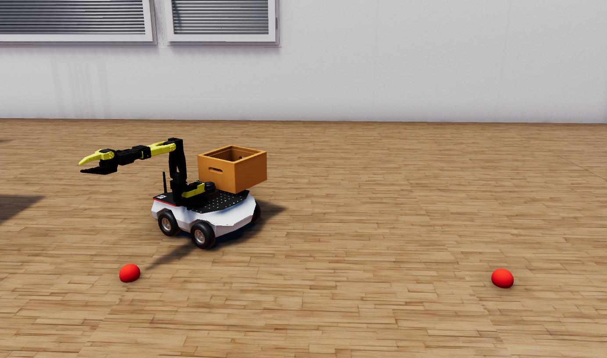

# LeRobot Hackathon 2025 at Robotec.ai



This project showcases the integration of [RAI](https://github.com/RobotecAI/rai) with the [LeRobot SO-101 arm](https://github.com/TheRobotStudio/SO-ARM100), mounted on a [ROSbot XL](https://husarion.com/manuals/rosbot-xl/overview) inside the [O3DE](https://www.o3de.org/) simulation environment. It was developed during the LeRobot Hackathon 2025 by the team LeRobotec at Robotec.ai, during which we successfully recorded a dataset of 20 demonstrations of the SO-101 arm picking up a red ball using teleoperation with the follower robot inside the simulation! Here's how one of the demonstrations looks like:


The robot can navigate around the environment using [nav2](https://docs.nav2.org/) and pick up red balls using the finetuned policy. All the tasks are executed by the RAI agent, which can be interacted with using the human-friendly [Streamlit](https://streamlit.io/) interface.

# Usage

1. Clone repository
```bash
git clone --recurse-submodules git@github.com:RobotecAI/lerobot-hackathon-2025.git
cd lerobot-hackathon-2025

export BASE=$(pwd)
```

2. Build and source ROS2 workspace:
```bash
cd $BASE
cd ros2_ws
colcon build --symlink-install
source install/setup.sh
```

3. Setup Python modules
```bash
cd $BASE
# install uv package manager
curl -LsSf https://astral.sh/uv/install.sh | sh
uv sync -p 3.10 # for Ubuntu 22.04
uv sync -p 3.12 # for Ubuntu 24.04
```

4. Test python env

```bash
source setup_shell.sh
python scripts/test_setup.py
```

5. Download the finetuned policy weights and the simulation binary

### TODO: Put commands with download links here

6. Run the simulation package.

```bash
ros2 launch lerobot_o3de demo.launch.py game_launcher:=path/to/sim.GameLauncher
```

7. Run RAI in streamlit

```bash
streamlit run scripts/rosbot-xl-demo.py
```